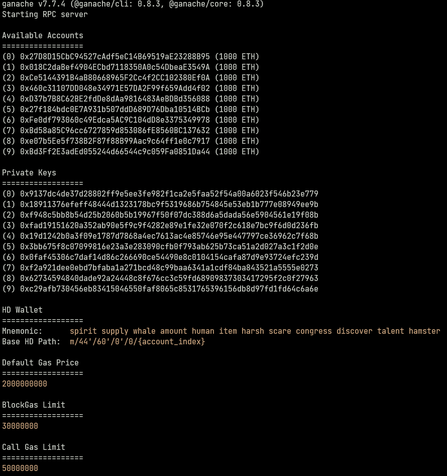
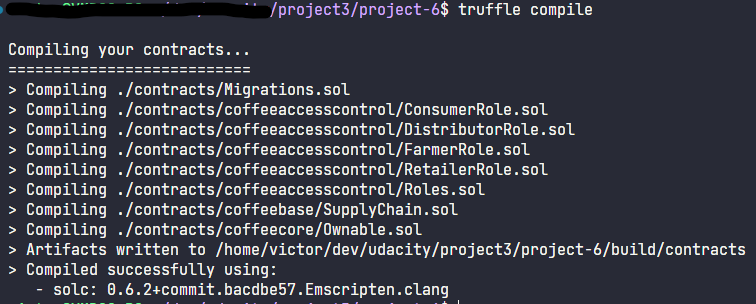
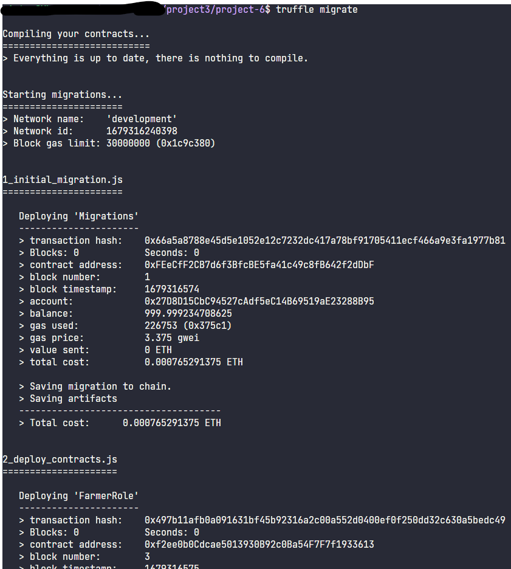
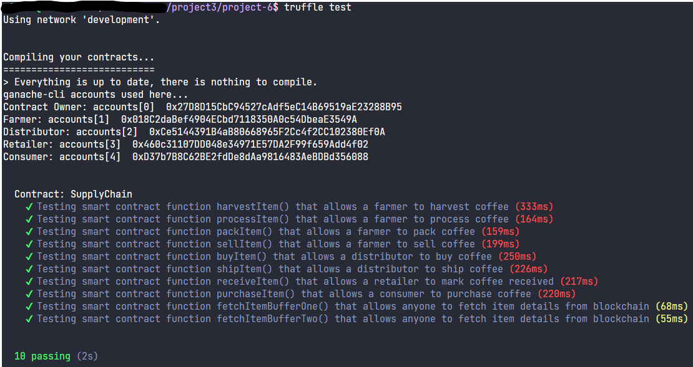

# Supply chain & data auditing

This repository containts an Ethereum DApp that demonstrates a Supply Chain flow between a Seller and Buyer. The user story is similar to any commonly used supply chain process. A Seller can add items to the inventory system stored in the blockchain. A Buyer can purchase such items from the inventory system. Additionally a Seller can mark an item as Shipped, and similarly a Buyer can mark an item as Received.


## Technologies used in this project

- Truffle v5.7.6 (core: 5.7.6)

- Ganache v7.7.4

- Solidity - 0.6.2 (solc-js)

- Node v16.19.0

- Web3.js v1.8.2


## Notes

Goerli SupplyChain deployed address: 0x7C12Be7fD08e4587A664156F04F863a1334dB433

([https://goerli.etherscan.io/address/0x7C12Be7fD08e4587A664156F04F863a1334dB433](https://goerli.etherscan.io/address/0x7C12Be7fD08e4587A664156F04F863a1334dB433))

Transaction id for deployed contract in Goerli network: 0xc1732cc8493a522ffa863979fe22c621785d2232f123b3002a14b86c64f721ca

([https://goerli.etherscan.io/tx/0xc1732cc8493a522ffa863979fe22c621785d2232f123b3002a14b86c64f721ca](https://goerli.etherscan.io/tx/0xc1732cc8493a522ffa863979fe22c621785d2232f123b3002a14b86c64f721ca))

UML diagrams are in "uml" directory.


## Getting Started

These instructions will get you a copy of the project up and running on your local machine for development and testing purposes. See deployment for notes on how to deploy the project on a live system.

### Prerequisites

Please make sure you've already installed ganache-cli, Truffle and enabled MetaMask extension in your browser. You can use the commands below to install Truffle and Ganache if you didn't have them yet.

```
npm install -g ganache

npm install -g truffle
```


### Installing

A step by step series of examples that tell you have to get a development env running

Clone this repository:

```
git clone https://github.com/vmdario/project3-udacity
```

Change directory to ```project-6``` folder and install all requisite npm packages (as listed in ```package.json```):

```
cd project-6
npm install
```

Launch Ganache:

```
ganache -m "spirit supply whale amount human item harsh scare congress discover talent hamster"
```

Your terminal should look something like this:



In a separate terminal window, Compile smart contracts:

```
truffle compile
```

Your terminal should look something like this:



This will create the smart contract artifacts in folder ```build/contracts```.

Migrate smart contracts to the locally running blockchain, ganache-cli:

```
truffle migrate
```

Your terminal should look something like this:



Test smart contracts:

```
truffle test
```

All 10 tests should pass.



In a separate terminal window, launch the DApp:

```
npm run dev
```

## Authors

See also the list of [contributors](https://github.com/your/project/contributors.md) who participated in this project.

## Acknowledgments

* Solidity
* Ganache-cli
* Truffle
* IPFS
